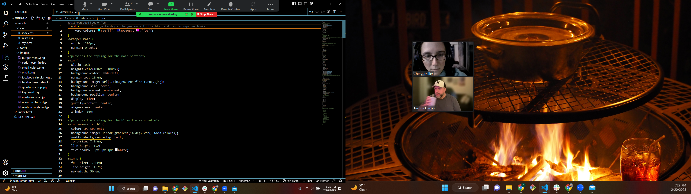
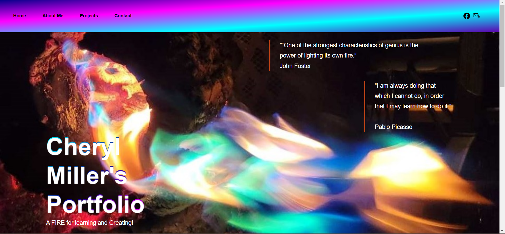
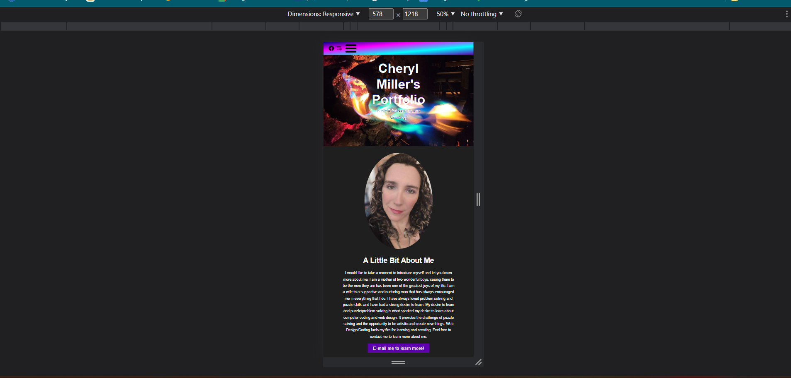

# week-2-challange-profile
* The main purpose of this is to lay the groundwork for my Portfolio that will help me get hired as a developer in the future. 

  ## Expected Outcome 
  There are several desired outcomes for this sited I developed 
  * To help me learn coding though hands on experience. 
  * To draw the attention of potential employers 
  * To showcase my skills learned up to this point 
  * To allow me to expand on my skills in the future
  * For the screen to be reactive 
  * For links to work 
  * When links are hovered over for them to react
  ## Actual Behavior 
  * There are 2 css pages one is the styling for the main body and the other is the styling for the hero ,categories/projects and about me section. When I was researching and learning the methods I came across broke it into two separate pages it works very well for me that way. 
  * The Page is eye catching and the links are reactive 
  * Not all the links for projects work but will be enabled when future projects are done
  * The link to Facebook does work 
  *  The links for E-mail open up and give the user the opportunity to email me.
  *  The page is reactive and does size down for viewing on a cell phone but I am still working on the code for tables
  *  The burger menu shows when viewed from a cell phone but I need to learn more JavaScript to make it reactive.
  ## Some pictures of my page and code. 
  
  Getting my groundwork the way I wanted took quite a few times of trial and error.
  
  There was several times that Joshua has been very helpful and looked at my code with me to problem solve sometimes a second set of eyes helps a lot.
   I am very happy that I was able to add a picture that I took. I would like to maybe add a gallory of pictures I took in the future. 
   It is still a work in progress for tablet size screens but the page is fully viewable from a phone or laptop. It is still viewable from a tablet as well but I would like it to flow just a little better.
